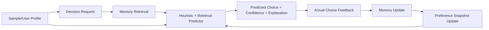

# bcd

[](https://www.python.org/)
[](./LICENSE)
[](#)

`bcd` is an open-source personalized decision prediction system.

It predicts **which option a specific user is most likely to choose**, not which option is objectively correct, globally optimal, or most popular.

> Given these options, what would *this user* most likely choose right now?

This repository is designed as a research-friendly MVP for personalized AI systems, memory-based reasoning, and context-aware preference modeling.

## Why bcd is interesting

Most recommendation systems optimize for generic relevance.

`bcd` focuses on a different target:

- personalized choice prediction over universal correctness
- long-term preference signals plus short-term context
- memory retrieval as a first-class component
- explanation and inspection from the beginning
- local reproducibility without external infrastructure

This makes the project a strong foundation for future work in:

- personalized NLP systems
- memory-augmented agents
- context-sensitive ranking
- preference drift tracking
- research baselines for personal decision modeling

## MVP capabilities

- bootstrap a sample user profile from lightweight onboarding data
- initialize new users with `MBTI + structured multiple-choice onboarding`
- accept a decision prompt with 2-5 candidate options
- incorporate optional structured context such as time, mood, energy, or social setting
- retrieve relevant memories and prior decision patterns
- predict the most likely user choice with confidence, structured explanation sections, and option-by-option score breakdowns
- log actual user feedback and reasons
- review, accept, reject, or edit extracted profile signals
- add and remove manual recent-state notes separately from stable profile signals
- store structured failure reasons when predictions miss
- update memory and short-term preference snapshots
- generate split Markdown cards for `stable profile` and `recent state`
- optionally use an OpenAI-compatible LLM for ranking
- expose a local FastAPI interface, CLI demo, and evaluation script

## System overview



## Architecture at a glance

- `profile`: sample user bootstrap and long-term preference signals
- `memory`: structured memory creation and top-k retrieval
- `decision`: request intake, option scoring, confidence normalization, explanation
- `reflection`: feedback logging, memory creation, snapshot updates
- `storage`: SQLModel tables, SQLite persistence, repository helpers
- `llm`: provider-agnostic extension interface for future rankers
- `api`: local HTTP interface for experimentation
- `evaluation`: reproducible baseline evaluation on sample cases

See [`docs/architecture.md`](docs/architecture.md) for more detail.

## Tech stack

- Python 3.11+
- FastAPI
- SQLModel + SQLite
- Pydantic v2
- Typer CLI
- pytest

## Quickstart

### 1. Create a virtual environment

```bash
python3 -m venv .venv
source .venv/bin/activate
pip install -e ".[dev]"
```

### 2. Initialize the sample user and seed history

```bash
python scripts/init_sample_data.py
```

### 3. Run the API

```bash
uvicorn bcd.api.app:app --reload
```

Then open:

- [http://127.0.0.1:8000/app](http://127.0.0.1:8000/app) for the user-friendly local demo
- [http://127.0.0.1:8000/docs](http://127.0.0.1:8000/docs) for Swagger / raw API testing

### 4. Run the local demo flow

```bash
python scripts/run_demo.py
```

### 5. Run the baseline evaluation

```bash
python scripts/evaluate_baseline.py
```

## Optional LLM mode

The repository works without any external API by default.

If you want LLM-assisted ranking, configure an OpenAI-compatible endpoint:

```bash
export BCD_PREDICTION_MODE=hybrid
export BCD_LLM_API_KEY=your_api_key
export BCD_LLM_BASE_URL=https://api.openai.com/v1
export BCD_LLM_MODEL=gpt-4.1-mini
```

Then use:

```bash
bcd-cli predict \
  --user-id sample-alex \
  --prompt "Pick dinner after a tiring rainy evening." \
  --category food \
  --options "Warm noodle soup|Greasy burger|Raw salad" \
  --context-json '{"time_of_day":"night","energy":"low","weather":"rainy","with":"alone"}' \
  --prediction-mode hybrid
```

Supported prediction modes:

- `baseline`: heuristic + retrieval only
- `llm`: LLM ranking only, with baseline fallback if unavailable
- `hybrid`: baseline ranking blended with LLM ranking

You can do this either:

- by setting environment variables before starting the server, or
- directly inside the `/app` browser demo by entering the API key, base URL, and model in the LLM settings section

## Minimal API flow

### Bootstrap the sample user

```bash
curl -X POST http://127.0.0.1:8000/profiles/bootstrap-sample
```

### Submit a prediction request

```bash
curl -X POST http://127.0.0.1:8000/decisions/predict \
  -H "Content-Type: application/json" \
  -d '{
    "user_id": "sample-alex",
    "prompt": "Pick dinner after a tiring rainy evening.",
    "category": "food",
    "context": {
      "time_of_day": "night",
      "energy": "low",
      "weather": "rainy",
      "with": "alone"
    },
    "options": [
      {"option_text": "Warm noodle soup"},
      {"option_text": "Greasy burger"},
      {"option_text": "Raw salad"}
    ]
  }'
```

### Record the actual choice

```bash
curl -X POST http://127.0.0.1:8000/decisions/<request_id>/feedback \
  -H "Content-Type: application/json" \
  -d '{
    "actual_option_id": "<option_id>",
    "reason_text": "Wanted something warm and easy.",
    "reason_tags": ["warm", "easy"]
  }'
```

### Inspect the generated profile card

```bash
curl http://127.0.0.1:8000/profiles/sample-alex/card
```

## Example output

The demo returns:

- a predicted top option
- ranked alternatives with confidences
- component-level scoring breakdowns for each option
- retrieved memories with retrieval roles and explanation cues
- structured explanation sections grounded in stable profile, recent state, and history
- feedback-driven memory and snapshot updates

This keeps the system interpretable enough for debugging while still showing a complete personalized decision loop.

## User-friendly local demo

The project now includes a browser-based local demo at `/app`.

It is intended for someone who wants to try the system quickly without manually composing API requests.

You can:

- create a profile from `MBTI + multiple-choice onboarding`
- import a ChatGPT data export (`.zip` or `conversations.json`) to bootstrap a profile in one step
- review extracted profile signals and correct them in place
- add temporary recent-state notes that affect the next prediction
- load the sample user profile
- type a decision question
- enter candidate options
- add simple context values
- switch between `baseline`, `hybrid`, and `llm`
- see the predicted choice, confidence, explanation, and retrieved memories
- submit actual feedback after the prediction, including structured miss reasons

## Core API endpoints

- `POST /profiles/bootstrap-sample`
- `POST /profiles/onboard`
- `POST /profiles/onboard/preview`
- `POST /profiles/import-chatgpt-export`
- `GET /profiles/{user_id}/signals`
- `POST /profiles/{user_id}/signals/{signal_id}/review`
- `GET /profiles/{user_id}/recent-state`
- `POST /profiles/{user_id}/recent-state`
- `DELETE /profiles/{user_id}/recent-state/{note_id}`
- `GET /profiles/{user_id}`
- `GET /profiles/{user_id}/card`
- `POST /decisions/predict`
- `POST /decisions/{request_id}/feedback`
- `GET /users/{user_id}/history`
- `GET /users/{user_id}/memories`

## Repository layout

```text
bcd/
├─ README.md
├─ LICENSE
├─ docs/
│  ├─ architecture.md
│  ├─ data_model.md
│  ├─ evaluation.md
│  └─ roadmap.md
├─ data/
│  ├─ sample_profiles/
│  └─ sample_decisions/
├─ demo/
│  └─ cli/
├─ scripts/
├─ src/bcd/
│  ├─ api/
│  ├─ decision/
│  ├─ evaluation/
│  ├─ llm/
│  ├─ memory/
│  ├─ profile/
│  ├─ reflection/
│  ├─ storage/
│  └─ utils/
└─ tests/
```

## Research extension points

The current baseline is intentionally simple and reproducible. Clear extension points are already separated for:

- vector retrieval backends such as FAISS or Chroma
- provider-agnostic LLM ranking
- richer temporal preference modeling
- synthetic users and benchmark tasks
- confidence calibration analysis
- preference drift and reflection research

## Documentation

- [`docs/architecture.md`](docs/architecture.md)
- [`docs/data_model.md`](docs/data_model.md)
- [`docs/evaluation.md`](docs/evaluation.md)
- [`docs/roadmap.md`](docs/roadmap.md)

## Current status

This is an intentionally lightweight MVP for open-source experimentation.

It is **not** a production consumer app and does **not** include:

- authentication
- billing
- app-store infrastructure
- deployment-heavy production concerns

The priority is a clean, extensible, inspectable foundation for personalized decision prediction research.
