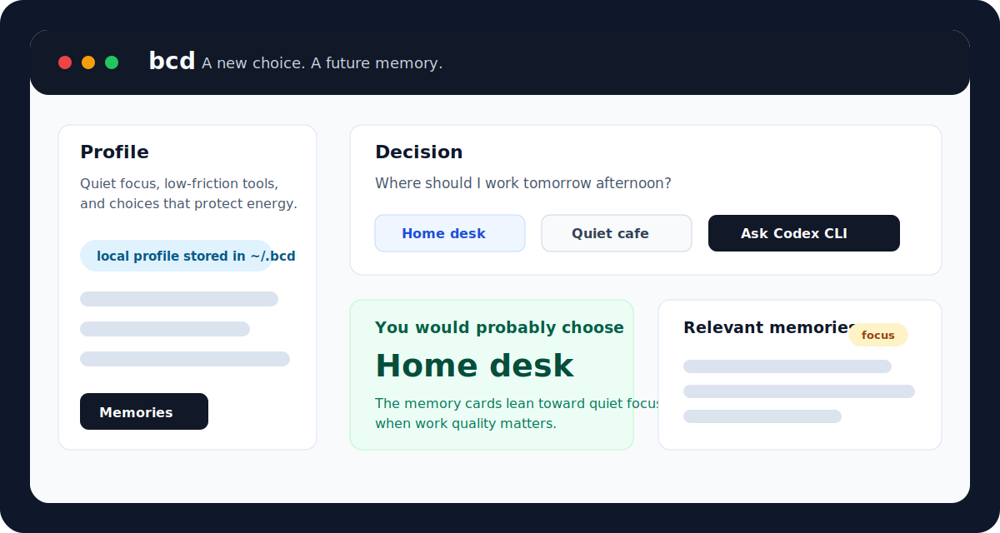

# bcd

[](LICENSE)
[](#local-first-by-design)
[](#requirements)

Your local choice mirror. bcd learns from the decisions you actually make, keeps the memory in readable files on your machine, and asks Codex CLI which option you would probably choose next.



## Why bcd exists

Most decision tools try to tell you what is objectively best. bcd is narrower and more personal: it helps you notice what is most like you.

It keeps a lightweight profile, turns past choices into Markdown memory cards, and uses Codex CLI as a thin reasoning layer. There is no local scoring engine pretending to know you, no vector database, and no fallback prediction when Codex fails.

If you like local-first AI tools, transparent personal data, and small software that does one thing clearly, a star helps other people find the project.

## Highlights

- Local-first profile and decision memory under `~/.bcd`
- Plain Markdown memories with frontmatter, not an opaque database
- Codex CLI connection check before first onboarding
- Manual onboarding or external AI profile import with raw-import consent
- Option suggestion before prediction, always requiring user confirmation
- Memory selection before prediction so prior choices can matter
- Fast prediction path with adaptive deep-mode escalation for harder decisions
- Three-role deep prediction panel for value fit, practicality, and regret risk
- Feedback saves quickly while reusable memory generation runs in the background
- Bounded debug logs for local inspection
- No fabricated fallback predictions when Codex CLI fails

## Demo flow

1. Create a profile from MBTI plus a few preference signals, or paste a compact profile exported from another AI.
2. Enter a question, confirmed options, and optional context.
3. Let bcd select relevant decision memories.
4. See the option you would probably choose, with confidence and rationale.
5. Save the actual choice so the next prediction has a better memory.

## Requirements

- Node.js 22.12 or newer
- npm
- Codex CLI installed and authenticated on the local machine

The server uses the `codex` command by default. On macOS it also checks `/Applications/Codex.app/Contents/Resources/codex`.

## Quick Start

```bash
git clone https://github.com/ronut01/bcd.git
cd bcd
npm install
npm run dev
```

Open [http://127.0.0.1:5173](http://127.0.0.1:5173).

The Vite dev server proxies API calls to [http://127.0.0.1:3737](http://127.0.0.1:3737).

## Build And Run

```bash
npm run build
npm start
```

Then open [http://127.0.0.1:3737](http://127.0.0.1:3737).

## Verify

```bash
npm run typecheck
npm test
npm run build
```

With a local server already running, the API smoke path can be checked with:

```bash
BCD_E2E_BASE_URL=http://127.0.0.1:3940 BCD_E2E_CODEX=0 npm run smoke:e2e
```

Set `BCD_E2E_CODEX=1` or omit it to include real Codex CLI calls.

## Local-First By Design

All user-owned runtime data lives outside the repository:

```text
~/.bcd/
  profile.md
  config.json
  profile-imports/
    latest-raw.md
  memories/
    *.md
  feedback/
    *.json
  debug/
    codex-calls.json
  tmp/
```

Important boundaries:

- `bcd.md` is intentionally ignored and remains the local direction document.
- `.omx/` is ignored and remains local orchestration state.
- `dist/`, `node_modules/`, `.env*`, and `.DS_Store` are ignored.
- Runtime profile, feedback, memories, and Codex debug logs are written to `~/.bcd`, not the repo.

## Configuration

Optional environment variables:

| Variable | Purpose | Default |
| --- | --- | --- |
| `BCD_HOME` | Runtime data directory | `~/.bcd` |
| `BCD_PORT` | API port | `3737` |
| `BCD_CODEX_BIN` | Codex CLI binary path | `codex` or macOS app fallback |
| `BCD_CODEX_MODEL` | Model argument passed to `codex exec` | unset |
| `BCD_CODEX_TIMEOUT_MS` | Codex request timeout | `120000` |
| `BCD_CODEX_CHECK_TIMEOUT_MS` | Codex readiness check timeout | `60000` |

`~/.bcd/config.json` currently supports `debugLogLimit`, which controls how many raw Codex request/response records are retained.

## Architecture

```text
React/Vite UI
  -> Node HTTP API
    -> file storage in ~/.bcd
    -> Codex CLI JSON prompts
      -> option suggestions
      -> memory selection
      -> fast or deep prediction
      -> background decision-card generation
```

The V1 implementation intentionally stays thin around Codex CLI. The app validates JSON boundaries, stores readable local artifacts, and refuses to invent a result when the AI call fails.

## Safety Boundary

bcd predicts what you would probably choose. It does not decide what is correct, safe, legal, medical, or financially optimal. Use it as a personal reflection tool, especially for high-stakes decisions.

## Roadmap

- Export/import packs for profile and memories
- Better memory search without giving up readable files
- Optional screenshot/gif demo in the README once the UI stabilizes
- More configurable deep-mode routing
- Future multi-agent debate mode as an explicit opt-in extension

## Contributing

Contributions are welcome if they preserve the local-first contract and keep the app small. Start with [CONTRIBUTING.md](CONTRIBUTING.md), open an issue for larger changes, and include verification evidence in pull requests.

## License

MIT. See [LICENSE](LICENSE).
