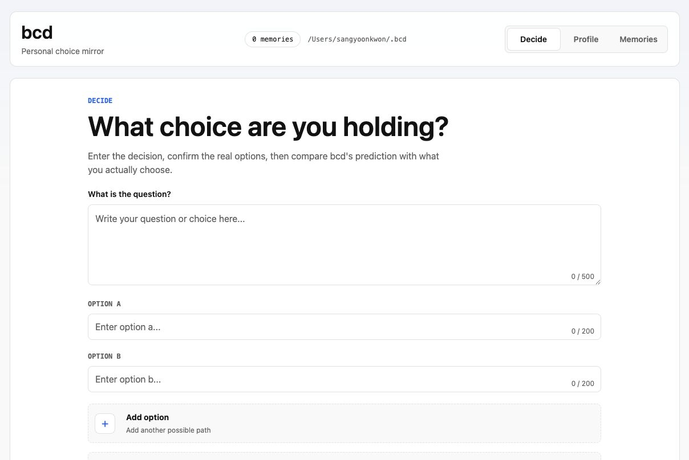

# bcd

[](LICENSE)
[](#local-first)
[](#requirements)

**bcd is a local-first personal choice mirror.** Give it a real decision, the options you are actually considering, and a little context. It predicts what you would probably choose, explains why, and turns your eventual choice into a readable memory for next time.



Most decision tools try to tell you what is best. bcd is narrower and more personal: it helps you notice what already sounds like you.

If that idea is useful, star the repo and watch releases. Small local-first AI tools deserve more attention.

## What It Does

- Keeps your profile, feedback, and decision memories locally under `~/.bcd`
- Suggests additional options without replacing the ones you wrote
- Lets you add suggested options one by one or all at once
- Predicts your likely choice from your profile, memories, question, options, and wording cues
- Uses a focused result dialog instead of splitting the screen
- Saves the actual choice and a short reason so future predictions improve
- Uses Codex CLI directly, with fewer round trips on the prediction path
- Refuses to fabricate fallback predictions when Codex fails

## Quick Start

```bash
git clone https://github.com/ronut01/bcd.git
cd bcd
npm install
npm run dev
```

Open [http://127.0.0.1:5173](http://127.0.0.1:5173).

## Requirements

- Node.js 22.12 or newer
- npm
- Codex CLI installed and authenticated locally

The server uses `codex` by default. On macOS it also checks `/Applications/Codex.app/Contents/Resources/codex`.

## How It Works

```text
React/Vite UI
  -> Node HTTP API
    -> ~/.bcd local files
    -> Codex CLI JSON prompts
      -> option suggestions
      -> merged memory selection + prediction
      -> optional deep prediction panel
      -> background memory-card generation
```

The prediction prompt treats your exact wording as evidence. A question written with hesitation, obligation, enthusiasm, avoidance, or unusual specificity can become a weak signal, alongside your profile and past choices.

## Local-First

Runtime data lives outside the repository:

```text
~/.bcd/
  profile.md
  config.json
  profile-imports/
  memories/
  feedback/
  debug/
  tmp/
```

No vector database. No opaque cloud memory store. No OpenAI API key required for the current CLI-based path.

## Configuration

| Variable | Purpose | Default |
| --- | --- | --- |
| `BCD_HOME` | Runtime data directory | `~/.bcd` |
| `BCD_PORT` | API port | `3737` |
| `BCD_CODEX_BIN` | Codex CLI binary path | `codex` or macOS app fallback |
| `BCD_CODEX_MODEL` | Model passed to `codex exec` | unset |
| `BCD_CODEX_TIMEOUT_MS` | Codex request timeout | `120000` |
| `BCD_CODEX_CHECK_TIMEOUT_MS` | Codex readiness timeout | `60000` |

## Verify

```bash
npm run typecheck
npm test
npm run build
```

## Safety

bcd predicts what you would probably choose. It does not decide what is correct, safe, legal, medical, or financially optimal. Use it as a reflection tool, especially for high-stakes decisions.

## Contributing

Contributions are welcome when they preserve the local-first contract and keep the app small. Start with [CONTRIBUTING.md](CONTRIBUTING.md), open an issue for larger changes, and include verification evidence.

## License

MIT. See [LICENSE](LICENSE).
