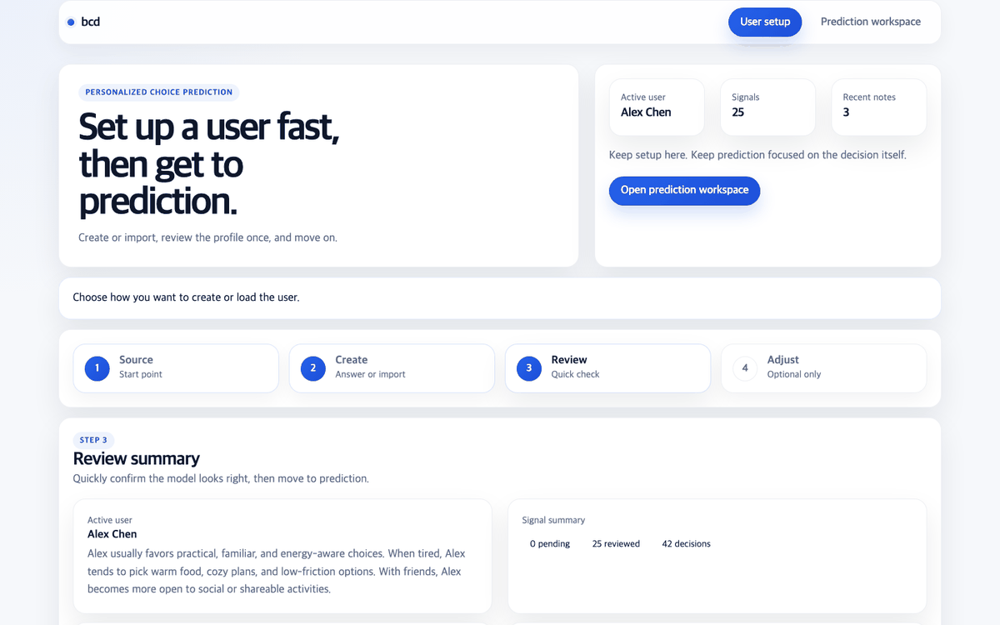
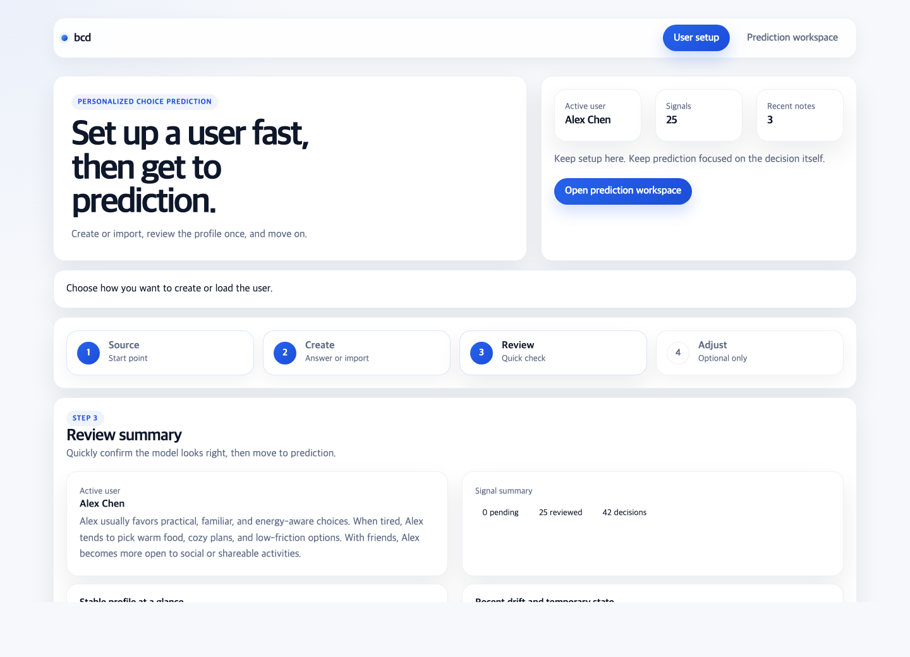
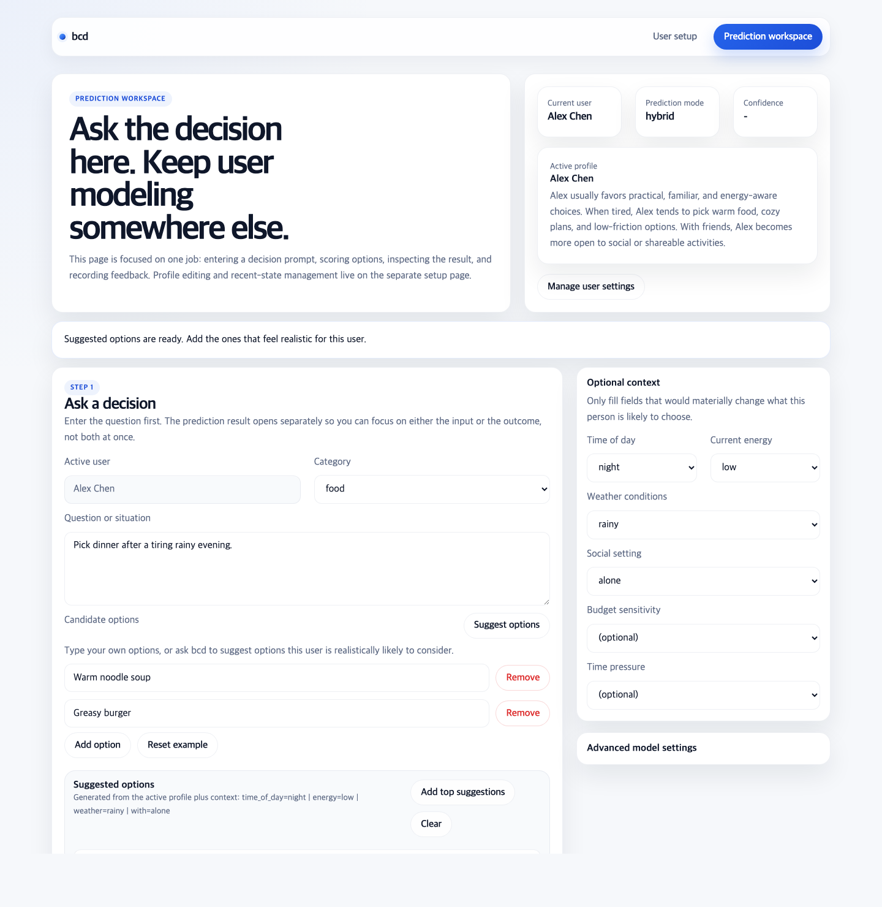
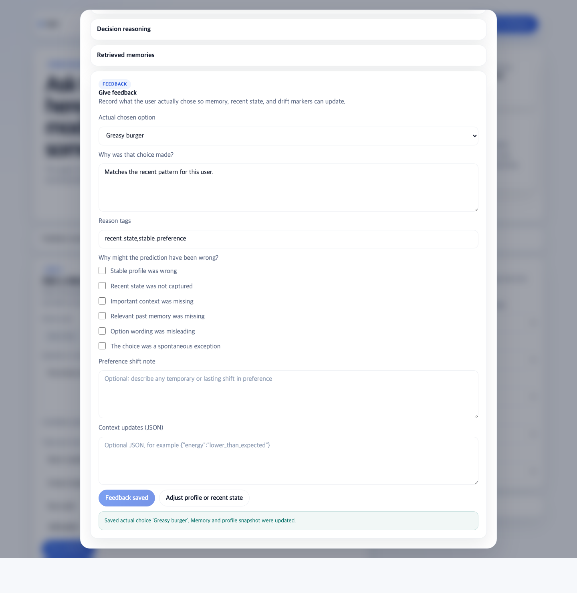
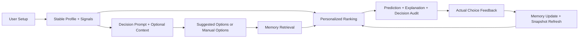

# bcd

[](https://www.python.org/)
[](./LICENSE)
[](#)

`bcd` is an open-source personalized decision prediction system.

It tries to answer one specific question:

> Given these options, what would this particular person most likely choose right now?

`bcd` is not trying to predict the objectively correct answer.  
It is not a generic "predict anything" engine.  
It is not a world simulation system.

It is focused on personal preference modeling, memory-based reasoning, recent-state influence, and feedback-driven adaptation.

## Visual Preview



| Setup the user | Ask the decision | Learn from feedback |
| --- | --- | --- |
|  |  |  |
| Build or import a profile, review signals, and manage recent state. | Enter a question, mix manual options with suggested options, and run prediction. | Inspect the result, save the actual choice, and let the next prediction adapt. |

## Why this repo is interesting

Most AI demos stop at generic recommendation or one-shot ranking.

`bcd` is built around a tighter and more personal loop:

- build a user profile from onboarding, imported conversations, and reviewed signals
- keep stable profile separate from recent state
- retrieve relevant past decisions as memory
- rank options for a specific person, not a generic audience
- explain why the current choice won
- record the actual outcome and feed it back into future predictions

The result is a local demo that feels closer to a real personalized AI product than a thin ranking script.

## What Makes bcd Distinct

- **Personalized prediction, not universal correctness**  
  The target is "what this user would do," not "what is best."

- **Stable profile + recent-state loop**  
  Long-term preferences, short-term notes, feedback shift markers, and carry-over context are modeled separately.

- **Memory-first reasoning**  
  Past choices are turned into retrievable memory and reused during prediction.

- **Inspectable decision reasoning**  
  Ranked options include component scores, supporting evidence, counter-evidence, memory retrieval reasons, and a decision audit.

- **Feedback actually changes the next prediction**  
  Actual choices create memory, update snapshots, and influence future ranking.

- **A polished local demo, not just raw APIs**  
  There is a two-page browser flow for setup, prediction, inspection, and feedback.

## What You Can Do Right Now

In the current codebase, you can:

- create a user from structured onboarding
- import a ChatGPT export to bootstrap a profile
- load a bundled sample user with seeded history
- review, accept, reject, or edit extracted profile signals
- add manual recent-state notes
- ask a decision question with 2 to 5 candidate options
- ask `bcd` to suggest likely candidate options for the current question
- provide optional structured context such as time of day, energy, weather, social setting, budget, and urgency
- inspect ranked options, explanations, retrieved memories, and decision audit details
- record the actual chosen option and why it differed
- update memory and preference snapshots through feedback
- switch between `baseline`, `hybrid`, and `llm` prediction modes

## A Quick Product Tour

The browser demo is split into two focused pages:

### `/app/setup`

Use this page to prepare the user model.

- create a user from onboarding
- import a ChatGPT export
- load the sample profile
- review and edit profile signals
- inspect stable profile vs recent-state summary
- add or remove recent-state notes

### `/app/predict`

Use this page to run the decision loop.

- enter a question or situation
- type your own candidate options
- ask `bcd` to suggest candidate options based on the active profile
- add optional context only when it materially matters
- inspect the prediction result in a separate modal
- review ranked alternatives, memory evidence, and decision audit
- submit actual feedback so the system adapts

## End-to-End Loop



## Quickstart

### 1. Install

```bash
python3 -m venv .venv
source .venv/bin/activate
pip install -e ".[dev]"
```

### 2. Run the local app

```bash
uvicorn bcd.api.app:app --reload
```

Then open:

- [http://127.0.0.1:8000/app/setup](http://127.0.0.1:8000/app/setup)
- [http://127.0.0.1:8000/app/predict](http://127.0.0.1:8000/app/predict)
- [http://127.0.0.1:8000/docs](http://127.0.0.1:8000/docs)

### 3. Try the fastest demo path

1. Open `/app/setup`
2. Click the sample profile or create your own user
3. Move to `/app/predict`
4. Enter a question
5. Either type options yourself or click `Suggest options`
6. Run prediction
7. Inspect the reasoning
8. Save actual feedback

No external infrastructure is required for the default flow.

## CLI and Scripts

If you prefer the terminal:

```bash
bcd-cli bootstrap
bcd-cli demo
bcd-cli evaluate
```

Equivalent helper scripts are also included:

```bash
python scripts/init_sample_data.py
python scripts/run_demo.py
python scripts/evaluate_baseline.py
```

## Example API Flow

### Bootstrap the sample user

```bash
curl -X POST http://127.0.0.1:8000/profiles/bootstrap-sample
```

### Ask `bcd` to suggest candidate options

```bash
curl -X POST http://127.0.0.1:8000/decisions/suggest-options \
  -H "Content-Type: application/json" \
  -d '{
    "user_id": "sample-alex",
    "prompt": "Pick dinner after a tiring rainy evening.",
    "category": "food",
    "context": {
      "time_of_day": "night",
      "energy": "low",
      "weather": "rainy"
    },
    "existing_options": ["Greasy burger"],
    "max_suggestions": 4
  }'
```

### Submit a prediction request

```bash
curl -X POST http://127.0.0.1:8000/decisions/predict \
  -H "Content-Type: application/json" \
  -d '{
    "user_id": "sample-alex",
    "prompt": "Pick dinner after a tiring rainy evening.",
    "category": "food",
    "context": {
      "time_of_day": "night",
      "energy": "low",
      "weather": "rainy",
      "with": "alone"
    },
    "options": [
      {"option_text": "Warm noodle soup"},
      {"option_text": "Greasy burger"},
      {"option_text": "Raw salad"}
    ]
  }'
```

### Record the actual choice

```bash
curl -X POST http://127.0.0.1:8000/decisions/<request_id>/feedback \
  -H "Content-Type: application/json" \
  -d '{
    "actual_option_id": "<option_id>",
    "reason_text": "Wanted something warm and easy.",
    "reason_tags": ["warm", "easy"],
    "failure_reasons": ["context_missing"],
    "context_updates": {"energy": "very_low"},
    "preference_shift_note": "Rain made comfort more important."
  }'
```

## What The Prediction Returns

The prediction result includes:

- a top predicted option
- ranked alternatives with normalized confidence
- component-level score breakdowns for each option
- supporting evidence and counter-evidence
- retrieved memories with retrieval roles and why they were retrieved
- explanation sections grounded in profile, recent state, and memory
- a decision audit with confidence label, margin, decisive factors, watchouts, adaptation signals, and active context

This makes the system inspectable enough to debug, evaluate, and extend.

## Optional LLM Mode

`bcd` works fully offline from a product-dependency perspective by default.  
You only need an external provider if you want LLM-assisted ranking.

Configure an OpenAI-compatible endpoint like this:

```bash
export BCD_PREDICTION_MODE=hybrid
export BCD_LLM_API_KEY=your_api_key
export BCD_LLM_BASE_URL=https://api.openai.com/v1
export BCD_LLM_MODEL=gpt-4.1-mini
```

Prediction modes:

- `baseline`: heuristic + memory retrieval only
- `hybrid`: baseline ranking blended with LLM ranking when available
- `llm`: LLM ranking first, with baseline fallback

You can set this either through environment variables or directly inside the browser demo's advanced model settings.

## Architecture At A Glance

- `profile`  
  User creation, onboarding, signal review, recent-state handling, profile cards, and snapshots

- `memory`  
  Structured memory retrieval and retrieval scoring

- `decision`  
  Candidate suggestion, option scoring, confidence normalization, explanation building, and decision audit generation

- `reflection`  
  Feedback logging, memory creation, and snapshot updates

- `storage`  
  SQLModel tables, SQLite persistence, and repository access

- `api`  
  FastAPI app and local browser demo

- `evaluation`  
  Sample evaluation flow for reproducible experiments

- `llm`  
  Optional provider-agnostic ranking layer

## Core API Endpoints

- `POST /profiles/bootstrap-sample`
- `GET /profiles/onboarding-questionnaire`
- `POST /profiles/onboard`
- `POST /profiles/onboard/preview`
- `POST /profiles/import-chatgpt-export`
- `GET /profiles/{user_id}`
- `GET /profiles/{user_id}/card`
- `GET /profiles/{user_id}/signals`
- `POST /profiles/{user_id}/signals/{signal_id}/review`
- `GET /profiles/{user_id}/recent-state`
- `POST /profiles/{user_id}/recent-state`
- `DELETE /profiles/{user_id}/recent-state/{note_id}`
- `POST /decisions/suggest-options`
- `POST /decisions/predict`
- `POST /decisions/{request_id}/feedback`
- `GET /users/{user_id}/history`
- `GET /users/{user_id}/memories`

## Repository Layout

```text
bcd/
├─ README.md
├─ bcd.md
├─ docs/
├─ data/
├─ demo/
├─ scripts/
├─ src/bcd/
│  ├─ api/
│  ├─ decision/
│  ├─ evaluation/
│  ├─ llm/
│  ├─ memory/
│  ├─ profile/
│  ├─ reflection/
│  ├─ storage/
│  └─ utils/
└─ tests/
```

## What bcd Is Not

At this stage, `bcd` is intentionally not:

- a production SaaS app
- an auth/billing/deployment-heavy platform
- a generic agent framework
- a simulation engine for the external world

The priority is a strong, inspectable, open-source personalized AI demo with a clean feedback loop.

## Good Next Directions

If you want to extend the repo, the clearest directions are:

- richer memory retrieval backends
- more realistic temporal preference modeling
- stronger evaluation sets and synthetic users
- improved candidate suggestion generation
- confidence calibration and failure analysis
- additional profile import flows

## Documentation

- [`docs/architecture.md`](docs/architecture.md)
- [`docs/data_model.md`](docs/data_model.md)
- [`docs/evaluation.md`](docs/evaluation.md)
- [`docs/roadmap.md`](docs/roadmap.md)
- [`docs/media/README.md`](docs/media/README.md)

## License

MIT. See [`LICENSE`](./LICENSE).
