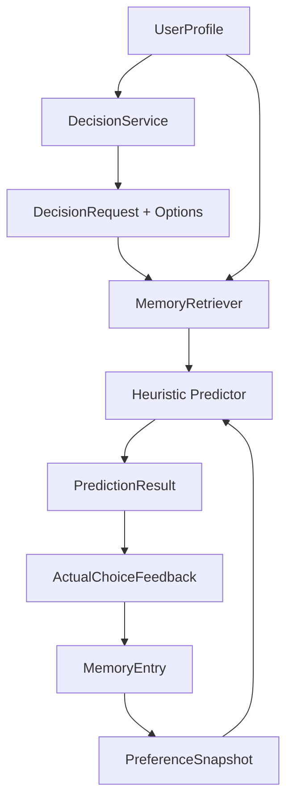

# Architecture

## System goals

The MVP focuses on a single-user, local-first decision prediction workflow:

1. bootstrap a sample user profile
2. submit a decision request with candidate options and context
3. retrieve relevant memories and prior decision patterns
4. rank options with a heuristic + retrieval hybrid predictor
5. log the actual user choice
6. update memory and preference snapshots

## Module boundaries

- `storage`: SQLite models, engine management, and repository helpers
- `profile`: sample profile bootstrap and stable preference signals
- `memory`: memory creation and retrieval logic
- `decision`: request intake, option scoring, confidence, and explanation
- `reflection`: feedback logging and snapshot updates
- `llm`: provider-agnostic extension point for future ranking assistance
- `api`: research-oriented local HTTP interface
- `evaluation`: baseline evaluation on sample cases

## Prediction strategy

The MVP uses a deterministic baseline:

- profile affinity from long-term preference keywords
- memory support from relevant historical cases
- context compatibility from current situation tags
- recent trend bonus from preference snapshots

This keeps the baseline reproducible while leaving clean extension points for:

- semantic retrieval
- vector databases
- LLM-assisted ranking
- sequence-based personalization

## Data flow

1. `ProfileService` loads or creates the sample user.
2. `DecisionService` stores a new request and candidate options.
3. `MemoryRetriever` fetches the most relevant memory entries.
4. `HeuristicDecisionPredictor` scores and ranks the options.
5. `ReflectionService` stores feedback and creates a new memory entry.
6. `PreferenceSnapshotService` recomputes short-term signals from recent history.
